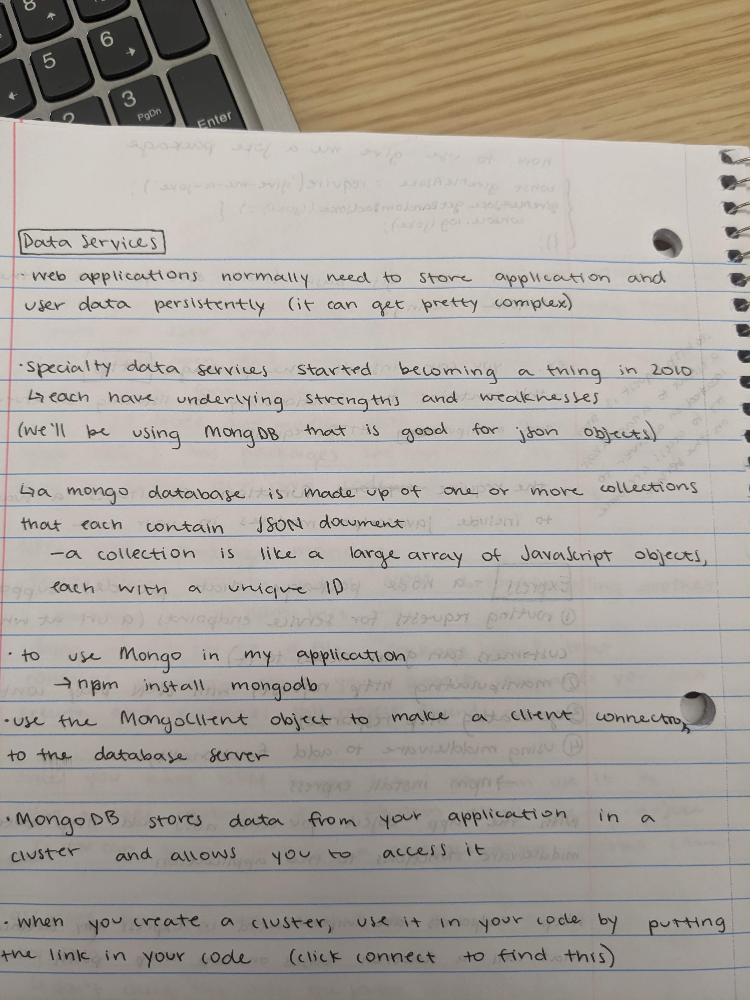
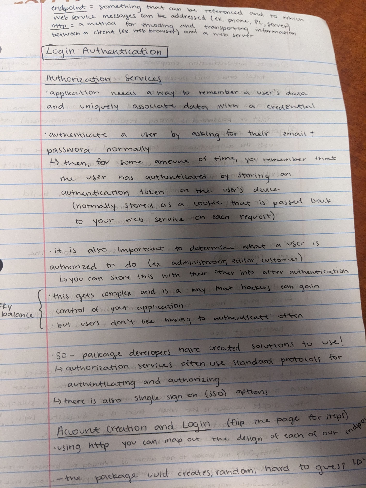
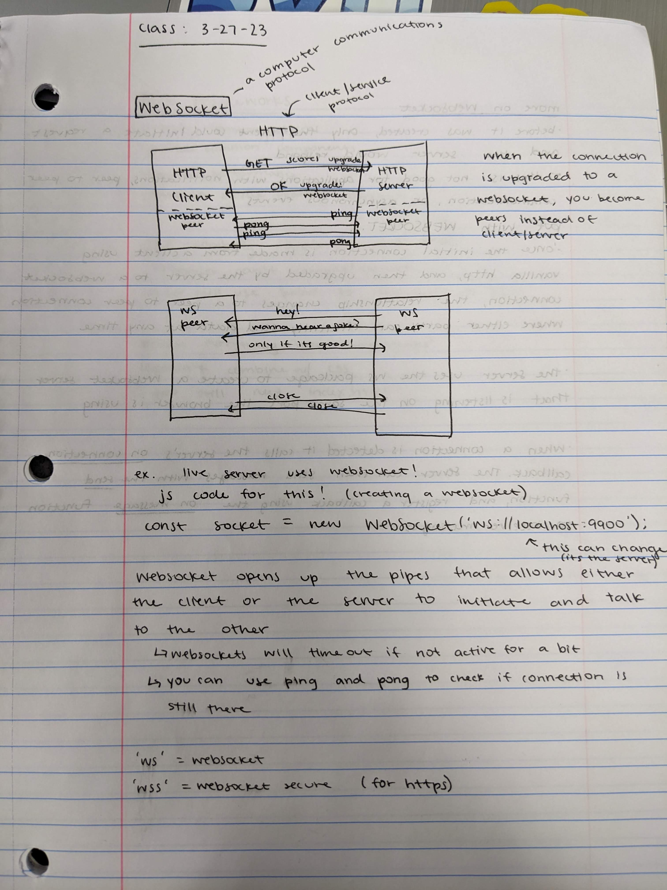
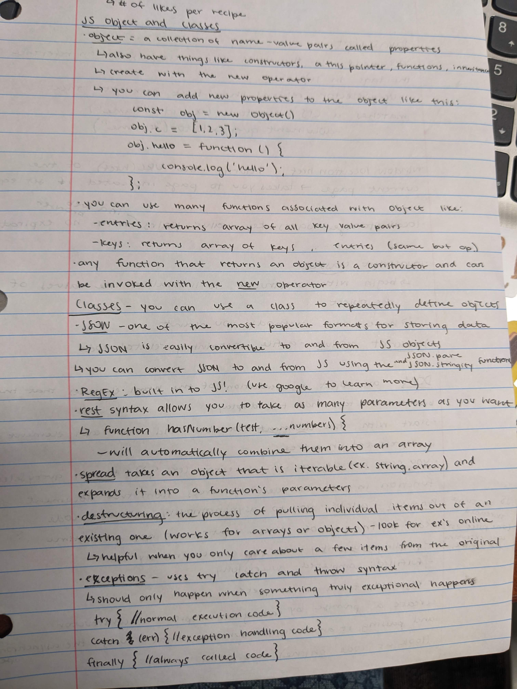
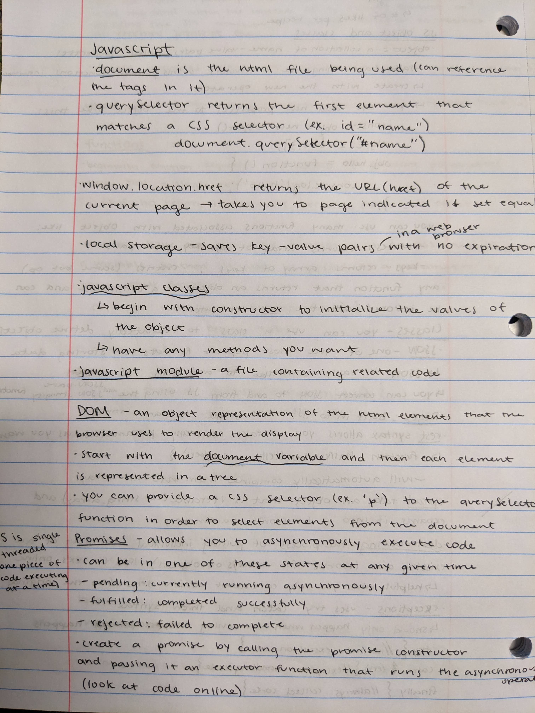
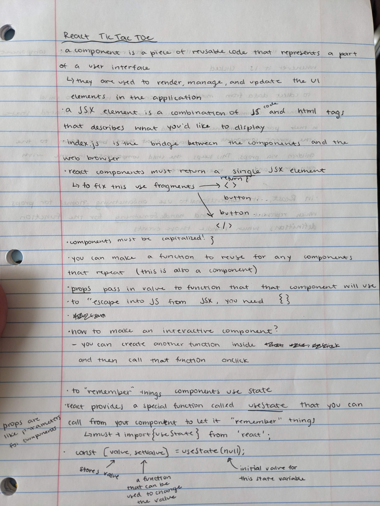

# startup

**this is my __very__ first git commit!!**

**my first notes**
I ran into many problems as I was trying to use github for the first time. It was tricky to figure some of the technicalities out, but I think things will get smoother as I become more familiar with the technology. I am happy I was able to figure out the issues I was running into!!

**Elevator Pitch: **
Haven't we all had the experience of savoring a fresh, buttery, sweet Crumbl cookie, only for it to soon be gone, leaving us wishing for more? But then you remember the substantial price and the hastle to get one, so you rethink your craving. With my Copycat Cookbook, finding and sharing the cookie recipes we crave has never been so easy! You have access to that same crumbl recipe at your finger tips, just waiting for you to make and enjoy. With an option to share your own recipes as well, the community of cookies lovers is sure to be all over this new Copycat Cookbook!

**key features: **
*ability to create account, 
view cookie recipes others have uploaded, 
like or comment on a recipe, 
upload your own cookie recipe*

**HTML what I learned**
I learned about the different tags needed in html files and how they work together to create the formatting. For the more obscure ones, google it! General structure is header, main, footer!

**what I learned after the html and css deliverable**
I have learned that designing a website is actually a really fun process that will suck you in as you try to perfect it. I learned that bootstrap is very useful for
most formatting things that are common problems. I learned that you should use the live server as much as possible to troubleshoot and test what you have done. And also that the less complicated a website is, the easier it is for both the developer and the user!

**what I learned after simon services**
I learned that using node and express allow you to update, in our case scores, and be able to access that information from any computer. We create this web service to be able to listen on a network for http requests. It is really neat to see the back end of web applications. It turns out they are about as complicated and difficult to understand as I would have thought. When I implement it in my startup, I will be able to use it for keeping track of how many likes each post has gotten.

**notes about data services**
(I did them on paper)

**notes about login authentication**

**notes about websockets**

**notes for javascript**

**react cli**
the react cli will configure a react application template for us to use as a starting place for the application when you download the package. 

**notes about react**

